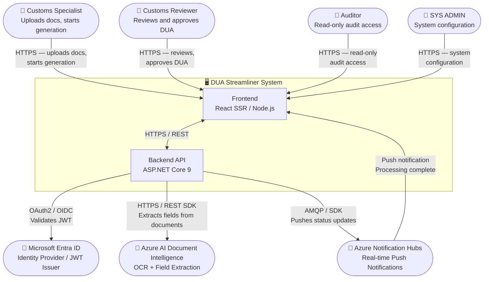
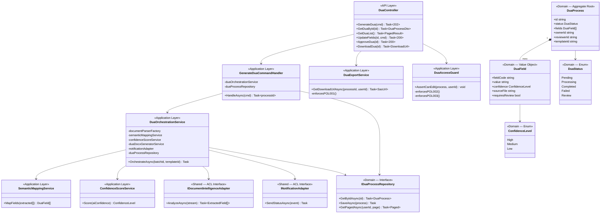

# DUA Streamliner — Intelligent System for Automated DUA Generation

## Problem

The Single Customs Document (DUA) requires filling in multiple fields based on heterogeneous documents (invoices, packing lists, certificates, bills of lading, insurance policies, permits, etc.).
Today, this process is usually done manually; it is repetitive, error-prone, and heavily dependent on expert knowledge, which can lead to delays, fines, or rejections.

---

## Project Objective

Design a solution that, given a folder containing documents (Excel, Word, PDF, and scanned images), is able to:

1. Read and extract content from multiple formats (including OCR for scanned files).
2. Semantically identify relevant customs data.
3. Automatically map the data to the official DUA fields.
4. Apply basic consistency validations and flag ambiguities.
5. Generate a pre-filled DUA Word file (.docx) with confidence indicators:

   * Green: high confidence
   * Yellow: medium confidence
   * Red: requires review

---

## Scope (for now)

This repository contains the **design** of the system (architecture, data models, UX/UI, quality, deployment/CI-CD, security, observability, etc.).
It does not include a functional implementation at this stage.

---

## Frontend

## [1.1 Technology stack](src/)

### Technology Stack

* **Application type:** Server-side rendering (SSR) web application
* **Web framework:** React.js `19.2`
* **Web server:** Node.js `21`
* **Coding language:** TypeScript `5.9.3`
* **State management:** Redux `5.0.1`
* **Unit testing framework:** Jest `30.2.0`
* **Integration testing tools:** Playwright `1.58.2`
* **Data validation framework:** Zod `4.3.6`
* **Code formatting framework:** Prettier `3.8.1`
* **Code style framework:** ESLint `10.0.2`
* **Code automation tasks:** Husky `9.1.7`
* **Cloud service:** Azure Cloud Services
* **Hosted services within the cloud:** Azure App Service
* **Code repository service:** Azure DevOps Repos
* **CI/CD pipelines technology:** Azure DevOps Pipelines
* **Environments:** Development, Stage, Production
* **Environment deployment tools:** Azure DevOps Environments
* **Observability framework:** Azure Application Insights SDK

---

## **[1.2 UX / UI Analysis](src/app)**


## Core Business Process


### Login

1. The user provides their login credentials and one-time authentication token.
2. The system validates the credentials with the authentication provider.
3. If the authentication fails, the system informs the user that the credentials are invalid.
4. If the authentication succeeds, the user session is created and the system allows access to the application.

---

### Configure the Generator

1. The user selects a folder path that contains the source documents.
2. The system scans the folder and identifies compatible documents such as Excel, Word, PDF, and images.
3. The user selects the official DUA template that will be used to generate the final document.
4. The system validates that the selected template matches the expected DUA structure.
5. Once configuration is confirmed, the system prepares the document processing pipeline.

---

### Monitor Processing Progress

1. The user starts the automated DUA generation process.
2. The system begins reading and interpreting all documents in the selected folder.
3. The system performs document parsing, semantic extraction, and validation of the detected information.
4. The system continuously updates the progress status of the process.
5. The user can observe the progress until the generation process is completed.

---

### Obtain Result / Export

1. After the process finishes, the system generates a completed DUA document based on the official template.
2. The system marks each extracted field with a confidence level.
3. The user reviews the generated information and verifies the extracted data.
4. The user exports the generated DUA document for external usage.

---

### Logout

1. The user ends the session.
2. The system invalidates the active authentication token.
3. The user session is terminated and access to the system is closed.

---

## Wireframes

## Login Screen

**Description**

The user authenticates using the Microsoft authentication service before accessing the system.

**Image**


---

## Folder Selection Screen

**Description**

The user provides the folder path that contains all source documents required to generate the DUA.

**Image**


---

## DUA Template Selection Screen

**Description**

The user selects the official DUA template that will be used as the structure for the generated document.

**Image**


---

## Processing Monitoring Screen

**Description**

The user observes the progress of the document processing pipeline while the system reads, analyzes, and extracts the required information from the source files.

**Image**


---

## Generated DUA Result Screen

**Description**

The user reviews the generated DUA document and verifies the extracted information before exporting the final document.

**Image**


---

----------------------------------------------------------------------
## Testing Results

| Screen | Avg Duration | Success Rate | Drop-off Rate | Misclick Rate | Responses | Ease of Task (Avg) |
|------|------|------|------|------|------|------|
| Login Screen | 14.6s | 100% | 0% | 66.7% | 3 | 8.3 |
| Folder Selection (Provide Path) | 4.8s | 100% | 0% | 50.0% | 3 | 9 |
| Folder Selection (Scan & Detect Files) | 3.0s | 100% | 0% | 40.0% | 3 | 9 |
| Folder Selection (Confirm Folder) | 5.7s | 100% | 0% | 36.4% | 3 | 9 |
| DUA Template Selection | 5.4s | 100% | 0% | 62.5% | 3 | 9.3 |
| Processing Monitoring | 4.9s | 100% | 0% | 0% | 3 | 10 |
| Generated DUA Result | 11.0s | 100% | 0% | 81.3% | 3 | 9 |

## Heatmaps for misclicks and drop-offs:

### Login Screen


### Folder Selection (Provide Path)


### Folder Selection (Scan & Detect Files)


### Folder Selection (Confirm Folder)


### DUA Template Selection


### Processing Monitoring


### Generated DUA Result


## Interviewees 

   - Felipe Bianchi Piedra // Lawyer
     
   - Ana María Chavarro Conde // Performance Analyst // https://estudianteccr-my.sharepoint.com/:v:/g/personal/jchavarro_estudiantec_cr/IQBCCIPmRKNUQItT_mE6pBeGAdeeQ2xYX6oNUpMMDdNW7dU?nav=eyJyZWZlcnJhbEluZm8iOnsicmVmZXJyYWxBcHAiOiJPbmVEcml2ZUZvckJ1c2luZXNzIiwicmVmZXJyYWxBcHBQbGF0Zm9ybSI6IldlYiIsInJlZmVycmFsTW9kZSI6InZpZXciLCJyZWZlcnJhbFZpZXciOiJNeUZpbGVzTGlua0NvcHkifX0&e=hNWbe5
     
   - Francisco Javier Chavarro Conde // Developer // https://estudianteccr-my.sharepoint.com/:v:/g/personal/jchavarro_estudiantec_cr/IQAKhMaJHWX9RIm7gFHuGdD0AZhXRi9ffmbFsEAiWdBOkbo?nav=eyJyZWZlcnJhbEluZm8iOnsicmVmZXJyYWxBcHAiOiJPbmVEcml2ZUZvckJ1c2luZXNzIiwicmVmZXJyYWxBcHBQbGF0Zm9ybSI6IldlYiIsInJlZmVycmFsTW9kZSI6InZpZXciLCJyZWZlcnJhbFZpZXciOiJNeUZpbGVzTGlua0NvcHkifX0&e=eZzLqk


----------------------------------------------------------------------
## **[1.3 Component Design Strategy](src/components)**

### Component Design Strategy

**Name of the strategy:**
Atomic Design

**Reutilization by:**
Components are organized hierarchically as **atoms, molecules, organisms, templates, and pages**.
Basic elements are created once and reused across the application to ensure consistency and reduce duplication.

**Internationalization by:**
Internationalization is implemented using **i18next**, with centralized translation files in [`src/i18n/`](src/i18n/).
Components reference translation keys instead of hardcoded text.

**Responsiveness by:**
Responsiveness is implemented using **TailwindCSS responsive utilities**, allowing layouts to adapt to different screen sizes such as desktop, tablet, and mobile devices.

### Visual Component Architecture

| Level | Folder | Key Files |
|---|---|---|
| Atoms | [`src/components/atoms/`](src/components/atoms/) | [`Button/`](src/components/atoms/Button/Button.tsx) · [`Input/`](src/components/atoms/Input/Input.tsx) · [`Label/`](src/components/atoms/Label/Label.tsx) · [`ConfidenceIndicator/`](src/components/atoms/ConfidenceIndicator/ConfidenceIndicator.tsx) |
| Molecules | [`src/components/molecules/`](src/components/molecules/) | [`FileUploader/`](src/components/molecules/FileUploader/FileUploader.tsx) · [`FormField/`](src/components/molecules/FormField/FormField.tsx) |
| Organisms | [`src/components/organisms/`](src/components/organisms/) | [`DuaForm/`](src/components/organisms/DuaForm/DuaForm.tsx) · [`Navbar/`](src/components/organisms/Navbar/Navbar.tsx) |
| Templates | [`src/components/templates/`](src/components/templates/) | [`MainLayout/`](src/components/templates/MainLayout/MainLayout.tsx) |
| Pages | [`src/components/pages/`](src/components/pages/) | [`pages.css/`](src/components/pages/pages.css) |

## [**1.4 Security**](src/auth)

Technologies, techniques, and classes—along with their respective locations within the project structure—responsible for authentication, authorization, permission management, and session handling.

### Authentication Configuration

| File | Description |
|---|---|
| [`src/auth/authConfig.ts`](src/auth/authConfig.ts) | MSAL configuration: `clientId`, `authority`, `redirectUri`, OAuth scopes for Dua and Users APIs |
| [`src/auth/roles.ts`](src/auth/roles.ts) | `RoleDefinitions` map — associates each `RoleType` with its allowed `PermissionCodes` |
| [`src/auth/permissions.ts`](src/auth/permissions.ts) | `hasPermission()` and `getPermissionsForRole()` — runtime RBAC enforcement helpers |
| [`src/auth/index.ts`](src/auth/index.ts) | Barrel export for the auth layer |

## Multi-Factor Authentication (MFA)
MFA supported: Yes

Supported MFA methods:
- Microsoft Authenticator App
- Time-based OTP (TOTP)
- SMS One-Time Password
- Voice Call OTP

## Single Sign-On (SSO)

SSO supported: Yes
Users authenticate using their Microsoft Entra organizational accounts, allowing centralized identity management and security policy enforcement.

# Social Authentication

| Provider | Supported |
|---|---|
| Google Authentication | No |
| Facebook Authentication | No |

**Reason**

The system processes sensitive operational documents.  
Authentication is restricted to **corporate identity providers** to ensure governance, traceability, and security compliance.


## RBAC Roles

| Role Name | Description |
|---|---|
| `SYS_ADMIN` | Full system administrator with access to security, configuration, roles, permissions, and observability features. |
| `CUSTOMS_SPECIALIST` | Main operational user responsible for configuring the generation process, starting processing, reviewing extracted data, and exporting the generated DUA. |
| `CUSTOMS_REVIEWER` | Business reviewer responsible for validating extracted information, correcting ambiguous fields, and approving generated DUA documents. |
| `AUDITOR` | Read-only user responsible for auditing, traceability, and historical review of system activity and generated DUA processes. |
| `SUPPORT_OPERATOR` | Technical support user with access to monitoring and diagnostics, but without permission to approve or export sensitive business documents. |

---

## Permissions by Role

### `SYS_ADMIN`

| Permission Code | Description |
|---|---|
| `AUTH_LOGIN` | Login to the system |
| `AUTH_LOGOUT` | Logout from the system |
| `DASHBOARD_VIEW` | View the main dashboard |
| `FOLDER_SELECT` | Select the source document folder |
| `DOCUMENT_SCAN_START` | Start document scanning |
| `DOCUMENT_LIST_VIEW` | View detected documents |
| `DUA_TEMPLATE_SELECT` | Select the official DUA template |
| `PROCESS_START` | Start the automated generation process |
| `PROCESS_MONITOR` | Monitor processing progress |
| `PROCESS_CANCEL` | Cancel an active process |
| `DUA_RESULT_VIEW` | View the generated DUA |
| `DUA_RESULT_EDIT` | Edit extracted DUA fields |
| `DUA_RESULT_APPROVE` | Approve the generated DUA |
| `DUA_RESULT_EXPORT` | Export the final DUA document |
| `HISTORY_VIEW` | View processing history |
| `AUDIT_LOG_VIEW` | View audit logs |
| `USER_ADMIN` | Manage users |
| `ROLE_ADMIN` | Manage roles and permissions |
| `SYSTEM_CONFIG` | Manage system configuration |
| `OBSERVABILITY_VIEW` | View monitoring and observability data |

### `CUSTOMS_SPECIALIST`

| Permission Code | Description |
|---|---|
| `AUTH_LOGIN` | Login to the system |
| `AUTH_LOGOUT` | Logout from the system |
| `DASHBOARD_VIEW` | View the main dashboard |
| `FOLDER_SELECT` | Select the source document folder |
| `DOCUMENT_SCAN_START` | Start document scanning |
| `DOCUMENT_LIST_VIEW` | View detected documents |
| `DUA_TEMPLATE_SELECT` | Select the official DUA template |
| `PROCESS_START` | Start the automated generation process |
| `PROCESS_MONITOR` | Monitor processing progress |
| `DUA_RESULT_VIEW` | View the generated DUA |
| `DUA_RESULT_EDIT` | Edit extracted DUA fields |
| `DUA_RESULT_EXPORT` | Export the final DUA document |
| `HISTORY_VIEW` | View processing history |

### `CUSTOMS_REVIEWER`

| Permission Code | Description |
|---|---|
| `AUTH_LOGIN` | Login to the system |
| `AUTH_LOGOUT` | Logout from the system |
| `DASHBOARD_VIEW` | View the main dashboard |
| `DOCUMENT_LIST_VIEW` | View detected documents |
| `PROCESS_MONITOR` | Monitor processing progress |
| `DUA_RESULT_VIEW` | View the generated DUA |
| `DUA_RESULT_EDIT` | Edit extracted DUA fields |
| `DUA_RESULT_APPROVE` | Approve the generated DUA |
| `DUA_RESULT_EXPORT` | Export the final DUA document |
| `HISTORY_VIEW` | View processing history |
| `AUDIT_LOG_VIEW` | View audit logs |

### `AUDITOR`

| Permission Code | Description |
|---|---|
| `AUTH_LOGIN` | Login to the system |
| `AUTH_LOGOUT` | Logout from the system |
| `DASHBOARD_VIEW` | View the main dashboard |
| `DOCUMENT_LIST_VIEW` | View detected documents |
| `PROCESS_MONITOR` | Monitor processing progress |
| `DUA_RESULT_VIEW` | View the generated DUA |
| `HISTORY_VIEW` | View processing history |
| `AUDIT_LOG_VIEW` | View audit logs |

### `SUPPORT_OPERATOR`

| Permission Code | Description |
|---|---|
| `AUTH_LOGIN` | Login to the system |
| `AUTH_LOGOUT` | Logout from the system |
| `DASHBOARD_VIEW` | View the main dashboard |
| `PROCESS_MONITOR` | Monitor processing progress |
| `HISTORY_VIEW` | View processing history |
| `OBSERVABILITY_VIEW` | View monitoring and observability data |

---

## ACL

**ACL supported:** Yes

**ACL service name:** `ACLService`

**Purpose of ACL:**
- Restrict access to specific DUA processes or generated documents
- Allow only the owner or assigned reviewer to modify a record
- Enforce read-only access for auditors
- Prevent support users from accessing sensitive export actions

---

## PBAC Policies

**PBAC supported:** Yes

**Policy service name:** `PolicyService`

| Policy Code | Policy Name | Definition |
|---|---|---|
| `POL-001` | `ExportOnlyWhenReviewed` | A DUA can only be exported after the process is completed and the document has been reviewed or approved by an authorized role. |
| `POL-002` | `EditOnlyBeforeApproval` | DUA fields can only be edited before the document is approved. |
| `POL-003` | `OwnerOrReviewerAccess` | Only the process owner, an assigned reviewer, or a system administrator can edit a DUA process. |
| `POL-004` | `AuditReadOnly` | Users with the `AUDITOR` role have read-only access to documents, history, and audit records. |
| `POL-005` | `SupportNoSensitiveExport` | Support users cannot approve, export, or modify business-sensitive DUA content. |

---

## Secure Store

**Secure store service:** `Azure Key Vault`

**Used for storing:**
- Environment variables
- API keys
- OAuth client secrets
- Database credentials
- Encryption keys
- Other sensitive application configuration

---

## Authenticator Server Name

**Authenticator server name:** `Microsoft Entra ID`


MFA management:
Handled by Microsoft Entra ID security policies.

## **[1.5 Layered Design](src/)**

The frontend performs **SSR (Server-Side Rendering)** using **React.js and Node.js** hosted in **Azure App Service**.

If there is no authenticated session, the **Authentication Layer** is invoked.

If authentication succeeds, the requested resource is rendered through the **Components Layer**.

The **Components Layer** follows **Atomic Design** principles (atoms, molecules, organisms, templates, and pages).

Inside components, a **Hooks Layer** connects component actions with the **Services Layer**.

The **Services Layer** contains the business operations of the application such as:

* document processing requests
* DUA generation orchestration
* export operations

Services may require access to the **Utils**, **ApiClients**, and **Settings** layers.

The **ApiClients Layer** contains classes responsible for calling external APIs such as document processing or backend services.

The **Settings Layer** reads environment variables and configuration values during runtime, including credentials stored in **Azure Key Vault**.

ApiClients retrieve API URLs, credentials, and tokens from the **Settings Layer**.

All ApiClient requests and responses are represented using classes in the **Models Layer**, which are validated using **Zod** in the **DataValidation Layer**.

The **State Management Layer** manages shared frontend state using **Redux**.

All layers may access the following shared layers:

* Models
* Utils
* State Management

The **NotificationService Layer** allows components and services to subscribe to asynchronous events.

Long-running processes such as document analysis return results through **callback notifications** handled by the NotificationService.

The **Logs Layer** records system events and sends telemetry data to **Azure Application Insights**.

The **ExceptionHandling Layer** provides centralized error management shared across all layers.

## Architecture Overview

```
          +----------------------+
          |      User Browser    |
          +----------+-----------+
                     |
                     v
          +----------------------+
          |    Azure App Service |
          |  NodeJS + React SSR  |
          +----------+-----------+
                     |
           SSR Request Handling
                     |
              Authentication
                     |
          +----------------------+
          |   Components Layer   |
          | Atomic Design UI     |
          | Atoms → Pages        |
          +----------+-----------+
                     |
                   Hooks
                     |
               Services Layer
                     |
   +----------------+----------------+
   |                |                |
 Utils          ApiClients        Settings
                                      |
                              Azure Key Vault
                                      |
                               Secrets / Config
ApiClients → External APIs External APIs → Notification Service (Callbacks)

Shared Layers:
Models
Zod Validation
Redux State Management
Exception Handling
Logs → Azure Application Insights

CI/CD:
Azure DevOps Repo → Pipelines → Dev / Stage / Prod → Azure App Service
```

---

## **[1.6 Design Patterns](src/documentProcessors)**

Use **Builder Pattern** and **Strategy Pattern** to create different document processors for formats such as **.docx, .xlsx, .pdf, .jpg, .png**.

Notification subscriptions are implemented through the **Observer Pattern** using the **NotificationService**, allowing components and services to receive processing status updates.

Use the **Adapter Pattern** to map extracted data into the official **DUA Word template**, using **FormatAdapters** and concrete formats such as **Paragraph, Table, Label, Amount**.

Use the **Factory Pattern** to instantiate the correct document processor depending on the detected file type.

Use **Singleton Pattern** for shared services:

* ExceptionHandling
* Utils
* StateManagement (Redux)
* ApiClients
* Settings classes

Use the **Pub/Sub pattern** through **Redux State Management** to propagate application state updates across components.

### Pattern Implementation

| Pattern | File(s) |
|---|---|
| Builder + Factory | [`src/documentProcessors/DocumentProcessorBuilder.ts`](src/documentProcessors/DocumentProcessorBuilder.ts) |
| Strategy — Interface | [`src/documentProcessors/strategies/IDocumentStrategy.ts`](src/documentProcessors/strategies/IDocumentStrategy.ts) |
| Strategy — Word | [`src/documentProcessors/strategies/WordStrategy.ts`](src/documentProcessors/strategies/WordStrategy.ts) |
| Strategy — Excel | [`src/documentProcessors/strategies/ExcelStrategy.ts`](src/documentProcessors/strategies/ExcelStrategy.ts) |
| Strategy — PDF | [`src/documentProcessors/strategies/PdfStrategy.ts`](src/documentProcessors/strategies/PdfStrategy.ts) |
| Strategy — Image | [`src/documentProcessors/strategies/ImageStrategy.ts`](src/documentProcessors/strategies/ImageStrategy.ts) |
| Adapter — Interface | [`src/documentProcessors/formatAdapters/IFormatAdapter.ts`](src/documentProcessors/formatAdapters/IFormatAdapter.ts) |
| Adapter — Paragraph | [`src/documentProcessors/formatAdapters/ParagraphAdapter.ts`](src/documentProcessors/formatAdapters/ParagraphAdapter.ts) |
| Adapter — Bullets | [`src/documentProcessors/formatAdapters/BulletsAdapter.ts`](src/documentProcessors/formatAdapters/BulletsAdapter.ts) |
| Adapter — Table | [`src/documentProcessors/formatAdapters/TableAdapter.ts`](src/documentProcessors/formatAdapters/TableAdapter.ts) |
| Adapter — Label | [`src/documentProcessors/formatAdapters/LabelAdapter.ts`](src/documentProcessors/formatAdapters/LabelAdapter.ts) |
| Adapter — Amount | [`src/documentProcessors/formatAdapters/AmountAdapter.ts`](src/documentProcessors/formatAdapters/AmountAdapter.ts) |
| Observer (Pub/Sub) | [`src/notificationService/NotificationService.ts`](src/notificationService/NotificationService.ts) |
| Singleton — State | [`src/state/store.ts`](src/state/store.ts) · [`src/state/StoreProvider.tsx`](src/state/StoreProvider.tsx) |
| Singleton — Settings | [`src/settings/Settings.ts`](src/settings/Settings.ts) |
| Singleton — Logger | [`src/logs/Logger.ts`](src/logs/Logger.ts) |
| Singleton — ExceptionHandler | [`src/exceptionHandling/ExceptionHandler.ts`](src/exceptionHandling/ExceptionHandler.ts) |

---

## [1.7 `/src` Project Scaffold](src/)

### `/src` folder structure

```
src/
├── app/                            → SSR routes and pages
│   ├── layout.tsx
│   ├── page.tsx
│   ├── globals.css
│   ├── login/
│   │   └── page.tsx
│   ├── dashboard/
│   │   └── page.tsx
│   ├── dua/
│   │   ├── page.tsx
│   │   └── [id]/
│   ├── reports/
│   │   └── page.tsx
│   ├── templates/
│   │   └── page.tsx
│   └── users/
│       └── page.tsx
│
├── components/                     → Atomic Design UI
│   ├── atoms/
│   │   ├── Button/
│   │   ├── ConfidenceIndicator/
│   │   ├── Input/
│   │   ├── Label/
│   │   └── atoms.css
│   ├── molecules/
│   │   ├── FileUploader/
│   │   ├── FormField/
│   │   └── molecules.css
│   ├── organisms/
│   │   ├── DuaForm/
│   │   ├── Navbar/
│   │   └── organisms.css
│   ├── templates/
│   │   ├── MainLayout/
│   │   └── templates.css
│   └── pages/
│       └── pages.css
│
├── hooks/                          → UI to service connection
│   ├── useAuth.ts
│   ├── useDua.ts
│   ├── useFileUpload.ts
│   └── useNotification.ts
│
├── services/                       → Application operations
│   ├── AuthService.ts
│   ├── DuaService.ts
│   ├── FileService.ts
│   ├── UserService.ts
│   └── index.ts
│
├── apiClients/                     → External API access
│   ├── BaseApiClient.ts
│   ├── AuthApiClient.ts
│   ├── DuaApiClient.ts
│   ├── FileApiClient.ts
│   ├── UserApiClient.ts
│   └── index.ts
│
├── auth/                           → Authentication and authorization
│   ├── authConfig.ts
│   ├── permissions.ts
│   ├── roles.ts
│   └── index.ts
│
├── documentProcessors/             → Builder + Strategy + Adapters
│   ├── DocumentProcessorBuilder.ts
│   ├── strategies/
│   │   ├── IDocumentStrategy.ts
│   │   ├── WordStrategy.ts
│   │   ├── ExcelStrategy.ts
│   │   ├── PdfStrategy.ts
│   │   └── ImageStrategy.ts
│   ├── formatAdapters/
│   │   ├── IFormatAdapter.ts
│   │   ├── ParagraphAdapter.ts
│   │   ├── BulletsAdapter.ts
│   │   ├── TableAdapter.ts
│   │   ├── LabelAdapter.ts
│   │   ├── AmountAdapter.ts
│   │   └── index.ts
│   └── index.ts
│
├── notificationService/            → Observer / callback notifications
│   └── NotificationService.ts
│
├── models/                         → Shared data models
│   ├── ApiResponse.ts
│   ├── Dua.ts
│   ├── FileUpload.ts
│   ├── Permission.ts
│   ├── Role.ts
│   ├── User.ts
│   └── index.ts
│
├── validation/                     → Zod validation layer
│   ├── duaSchema.ts
│   ├── fileSchema.ts
│   ├── userSchema.ts
│   └── index.ts
│
├── state/                          → State management
│   ├── StoreProvider.tsx
│   ├── hooks.ts
│   ├── store.ts
│   └── slices/
│       ├── authSlice.ts
│       ├── duaSlice.ts
│       └── fileSlice.ts
│
├── settings/                       → Configuration / Key Vault access
│   └── Settings.ts
│
├── logs/                           → Logging layer
│   └── Logger.ts
│
├── exceptionHandling/              → Shared exception handling
│   └── ExceptionHandler.ts
│
├── utils/                          → Reusable helpers
│   ├── constants.ts
│   ├── formatters.ts
│   └── index.ts
│
├── i18n/                           → Internationalization
│   ├── config.ts
│   └── locales/
│       ├── en.json
│       └── es.json
│
├── __tests__/                      → Unit and e2e tests
│   ├── setup.ts
│   ├── unit/
│   │   ├── auth/
│   │   ├── documentProcessors/
│   │   ├── notificationService/
│   │   └── services/
│   └── e2e/
│       └── dua.spec.ts
│
├── __mocks__/                      → Test mocks
│   └── styleMock.ts
│
├── types/                          → Type declarations
├── instructions.md                 → Project notes / scaffold instructions
├── package.json
├── tsconfig.json
├── jest.config.ts
├── playwright.config.ts
├── next.config.ts
├── .env.example
├── .eslintrc.json
├── .prettierrc
├── .lintstagedrc.json
└── .husky/
    └── pre-commit                                           
```

---

### [State Management](src/state/)

Redux is used for shared frontend state via the **Pub/Sub pattern**. The store is composed of three slices:

| File | Description |
|---|---|
| [`src/state/store.ts`](src/state/store.ts) | Configures the Redux store with `auth`, `dua`, and `file` reducers |
| [`src/state/StoreProvider.tsx`](src/state/StoreProvider.tsx) | Wraps the application with the Redux `Provider` |
| [`src/state/hooks.ts`](src/state/hooks.ts) | Typed `useAppSelector` and `useAppDispatch` hooks |
| [`src/state/slices/authSlice.ts`](src/state/slices/authSlice.ts) | Auth state: `isAuthenticated`, `user`, `role`, `accessToken` |
| [`src/state/slices/duaSlice.ts`](src/state/slices/duaSlice.ts) | DUA process state: generation status, fields, confidence levels |
| [`src/state/slices/fileSlice.ts`](src/state/slices/fileSlice.ts) | File upload state: selected files, upload progress |

---

### [Data Validation](src/validation/)

Validation is implemented using **Zod** schemas. All API inputs and model shapes are validated before use.

| File | Description |
|---|---|
| [`src/validation/duaSchema.ts`](src/validation/duaSchema.ts) | Schemas for DUA generation input, field shape, and full DUA document |
| [`src/validation/fileSchema.ts`](src/validation/fileSchema.ts) | Validates uploaded file metadata and allowed extensions |
| [`src/validation/userSchema.ts`](src/validation/userSchema.ts) | Validates user creation and update payloads |
| [`src/validation/index.ts`](src/validation/index.ts) | Barrel export for all schemas |

---

### [Observability & Exception Handling](src/logs/)

| File | Description |
|---|---|
| [`src/logs/Logger.ts`](src/logs/Logger.ts) | Singleton logger — sends `info`, `warn`, `error`, and `trackEvent` telemetry to **Azure Application Insights** |
| [`src/exceptionHandling/ExceptionHandler.ts`](src/exceptionHandling/ExceptionHandler.ts) | Singleton — centralized `handle()` and `handleAsync()` methods used by all layers |

---

### [Testing](src/__tests__/)

| File / Folder | Description |
|---|---|
| [`src/__tests__/unit/auth/`](src/__tests__/unit/auth/permissions.test.ts) | Unit tests for `hasPermission` and `getPermissionsForRole` |
| [`src/__tests__/unit/documentProcessors/`](src/__tests__/unit/documentProcessors/DocumentProcessorBuilder.test.ts) | Unit tests for `DocumentProcessorBuilder` and strategy selection |
| [`src/__tests__/unit/notificationService/`](src/__tests__/unit/notificationService/NotificationService.test.ts) | Unit tests for subscribe, notify, and unsubscribe flows |
| [`src/__tests__/unit/services/`](src/__tests__/unit/services/DuaService.test.ts) | Unit tests for `DuaService` orchestration |
| [`src/__tests__/e2e/dua.spec.ts`](src/__tests__/e2e/dua.spec.ts) | Playwright end-to-end test: full DUA generation flow |
| [`src/__tests__/setup.ts`](src/__tests__/setup.ts) | Jest global test setup |
| [`src/__mocks__/styleMock.ts`](src/__mocks__/styleMock.ts) | CSS module mock for Jest |

---

### [Configuration](src/)

| File | Description |
|---|---|
| [`src/next.config.ts`](src/next.config.ts) | Next.js config: `standalone` output, i18n locales (`en`, `es`), Azure Key Vault and App Insights runtime config |
| [`src/jest.config.ts`](src/jest.config.ts) | Jest config: `ts-jest` preset, `jsdom` environment, path aliases for all layers (`@components`, `@services`, `@auth`, etc.) |
| [`src/playwright.config.ts`](src/playwright.config.ts) | Playwright config: Chromium + Firefox projects, `baseURL`, screenshot on failure, CI retry policy |
| [`src/tsconfig.json`](src/tsconfig.json) | TypeScript compiler options and path aliases |
| [`src/.env.example`](src/.env.example) | Environment variable template: Azure AD, Key Vault, App Insights, API base URL, callback URL |
| [`src/.eslintrc.json`](src/.eslintrc.json) | ESLint ruleset |
| [`src/.prettierrc`](src/.prettierrc) | Prettier formatting rules |
| [`src/.lintstagedrc.json`](src/.lintstagedrc.json) | lint-staged config for pre-commit hooks |
| [`src/.husky/pre-commit`](src/.husky/pre-commit) | Husky pre-commit hook — runs lint-staged before every commit |
| [`src/settings/Settings.ts`](src/settings/Settings.ts) | Singleton — resolves secrets from Azure Key Vault or environment variables at runtime |

---

---

# Backend

## [2.1 Technology Stack](duabusiness/)

| Dimension | Decision | Justification |
|---|---|---|
| **Transport protocol** | HTTPS / TLS 1.3 | Internet-facing API; TLS is mandatory for customs data in transit |
| **API style** | REST over HTTP/1.1 | Broad integration support, native HTTP caching, well-understood by customs tooling consumers |
| **API contract standard** | OpenAPI 3.1 | Auto-generated documentation, client SDK generation, and contract-first design |
| **Async / long-running operations** | Azure Notification Hubs (push) + polling fallback | DUA generation can take 30–120 seconds; push notifications decouple the client from blocking waits |
| **Coding language** | C# — .NET 9 | Native Azure integration, ASP.NET Core performance, strong typing aligned with the customs domain model |
| **Web framework** | ASP.NET Core 9 (Minimal API + Controllers) | Minimal API for lightweight endpoints; Controllers for complex resource domains (DUA, Files, Users) |
| **ORM** | Entity Framework Core 9 | Code-first migrations, LINQ query composition, Azure SQL compatibility |
| **Database** | Azure SQL Database (General Purpose tier) | Relational structure fits the DUA field model; managed failover, auditing built-in |
| **Blob storage** | Azure Blob Storage | Stores raw uploaded documents and generated DUA `.docx` files outside the database |
| **Unit testing** | xUnit 2.9 | Standard .NET testing framework; compatible with Azure DevOps test reporting |
| **Integration testing** | xUnit 2.9 using the `Microsoft.AspNetCore.Mvc.Testing` namespace | `Microsoft.AspNetCore.Mvc.Testing` is a namespace included in the .NET SDK (not an external tool) that enables spinning up an in-process `WebApplicationFactory<T>` test server; integration tests are authored and executed with xUnit like any other test |
| **Data validation** | FluentValidation 11 | Declarative validator classes per request model; separates validation from controller logic |
| **API documentation** | OpenAPI 3.1 via built-in `Microsoft.AspNetCore.OpenApi` (.NET 9) | .NET 9 ships native OpenAPI document generation without third-party libraries; interactive API explorer served by the `Scalar` NuGet package in non-production environments only |
| **Code style** | EditorConfig + StyleCop.Analyzers | Enforces consistent C# formatting across the team |
| **Code automation** | Husky.NET (pre-commit hooks) | Runs linting and unit tests before every commit |
| **Cloud service** | Azure Cloud Services | Same ecosystem as the frontend; unified identity (Entra ID), billing, and monitoring |
| **Hosting** | Azure App Service (B3 tier, auto-scale to P2v3) | PaaS removes OS patching; auto-scale handles processing spikes |
| **API gateway** | Azure API Management (Developer tier → Standard in prod) | Rate limiting, JWT validation at the edge, OpenAPI publishing, versioning |
| **Async messaging** | Azure Notification Hubs | Sends real-time processing status updates to the frontend callback URL |
| **File streaming** | Azure Blob Storage multipart streaming | Large files are streamed directly to blob; avoids in-memory buffering on the API server |
| **AI / OCR service** | Azure AI Document Intelligence (Form Recognizer) | Extracts structured fields from invoices, packing lists, and scanned images; returns bounding-box confidence scores used to populate `ConfidenceLevel` |
| **Environments** | Development · Stage · Production | Separate App Service slots; Stage is a full-fidelity copy of Production for final validation |
| **Repository** | Monorepo — `duabusiness/` folder | Shares the same Azure DevOps repo as the frontend (`duawebapp/`) |

---

## [2.2 Architecture Style, Repository Strategy and DDD](duabusiness/)

### Architecture Style: Modular Monolith ✅

The backend is a **single deployable ASP.NET Core application**. It is **not** split into microservices. All bounded contexts run inside the same process, share the same database, and are deployed together as one artifact.

Microservices were evaluated and explicitly ruled out: the domain is still being validated, the team is two developers, and the operational overhead of distributed tracing, network retries, and saga orchestration is not justified at this stage. The modular monolith gives clean internal boundaries (bounded contexts) while keeping deployment simple. If traffic grows significantly, individual contexts can be extracted to separate services later with minimal refactoring, because they already communicate only through shared interfaces.

### Repository Strategy: Monorepo

Both `duawebapp/` (frontend) and `duabusiness/` (backend) live inside the same Azure DevOps repository, each in their own root folder. A single pull request can span an API contract change and the frontend client that consumes it, eliminating version drift between layers. CI/CD pipelines use path filters so changes in `duawebapp/` only trigger the frontend pipeline and changes in `duabusiness/` only trigger the backend pipeline.

### Domain-Driven Design (DDD)

DDD is applied as a **design approach**, not as a deployment topology. Bounded contexts are the primary tool for enforcing module boundaries inside the monolith. Each context owns its own domain model, application services, repository interfaces, and validators. No context imports another context's internal classes.

#### Bounded Contexts

#### Bounded Contexts

Each bounded context encapsulates its own controllers, services, domain models, repositories, and validators. Cross-context communication is only allowed through shared interfaces defined in [`duabusiness/Shared/`](duabusiness/Shared/) — never by importing another context's internal classes directly.

| Bounded Context | Responsibility | Key Folder |
|---|---|---|
| **Identity** | Authentication token validation, role and permission enforcement, session metadata | [`duabusiness/Identity/`](duabusiness/Identity/) |
| **DocumentIngestion** | Receives uploaded files, streams to Azure Blob Storage, triggers processing pipeline | [`duabusiness/DocumentIngestion/`](duabusiness/DocumentIngestion/) |
| **DuaGeneration** | Orchestrates OCR extraction, semantic mapping, confidence scoring, and `.docx` generation | [`duabusiness/DuaGeneration/`](duabusiness/DuaGeneration/) |
| **TemplateManagement** | CRUD for official DUA templates stored in blob and registered in the database | [`duabusiness/TemplateManagement/`](duabusiness/TemplateManagement/) |
| **UserManagement** | User CRUD, role assignments, audit trail of role changes | [`duabusiness/UserManagement/`](duabusiness/UserManagement/) |
| **Observability** | Structured logging, event tracking, health endpoints | [`duabusiness/Observability/`](duabusiness/Observability/) |

### Anti-Corruption Layer (ACL)

The **Anti-Corruption Layer** protects the domain model from leaking concepts or data structures that belong to external systems. Two ACL adapters are defined in [`duabusiness/Shared/Adapters/`](duabusiness/Shared/Adapters/):

| Adapter | External System | What it translates |
|---|---|---|
| `DocumentIntelligenceAdapter` | Azure AI Document Intelligence API | Converts Azure SDK's `AnalyzeResult` (with bounding boxes, page references, raw confidence floats) into the domain's `ExtractedField` value object. The domain never sees Azure SDK types. |
| `NotificationHubAdapter` | Azure Notification Hubs SDK | Converts domain events (`DuaStatusUpdatedEvent`) into Azure Notification Hubs push payloads. The domain never imports the Azure Notification Hubs namespace. |

This ensures that a change in the Azure AI SDK response schema or a migration to a different OCR provider only requires modifying the adapter class, not touching any domain or application logic.

---

## [2.3 Layered Design](duabusiness/)

The backend follows a **Clean Architecture** layering, with dependency flow pointing inward (infrastructure depends on domain, never the reverse).

```
HTTP Request
     │
     ▼
┌─────────────────────────────┐
│     API Layer               │  ASP.NET Core Controllers / Minimal API routes
│  (Controllers, Middleware)  │  JWT validation middleware, rate limiting, request logging
└────────────┬────────────────┘
             │
             ▼
┌─────────────────────────────┐
│   Application Layer         │  Command / Query handlers (CQRS-lite)
│  (Services, Validators)     │  FluentValidation, orchestration logic, no domain rules here
└────────────┬────────────────┘
             │
             ▼
┌─────────────────────────────┐
│   Domain Layer              │  Entities, Value Objects, Domain Services, Repository interfaces
│  (Entities, Aggregates)     │  Pure C# — no framework dependencies
└────────────┬────────────────┘
             │
             ▼
┌─────────────────────────────┐
│   Infrastructure Layer      │  EF Core DbContext, Azure Blob Storage client,
│  (Repositories, Adapters)   │  Azure AI Document Intelligence adapter, Notification Hubs adapter
└─────────────────────────────┘

Shared / Cross-cutting:
  Settings (Azure Key Vault)
  Logger (Application Insights)
  ExceptionHandler (global middleware)
  Models / DTOs
```

**Request flow narrative:**

1. An HTTP request arrives at **Azure API Management**, which validates the JWT issued by Microsoft Entra ID and enforces rate limits.
2. APIM forwards the request to the **ASP.NET Core API Layer** running in Azure App Service.
3. The JWT middleware extracts the user's role and injects it into the `HttpContext`.
4. The controller delegates work to the **Application Layer** service, passing validated request DTOs.
5. Application services call **Domain Layer** aggregates and repository interfaces.
6. The **Infrastructure Layer** fulfills repository contracts via EF Core (Azure SQL) or the Blob Storage / AI Document Intelligence clients.
7. For long-running operations (DUA generation), the Application Layer returns a `202 Accepted` with a `processId`, then pushes progress updates via **Azure Notification Hubs** to the frontend callback URL.

---

## [2.4 Security](duabusiness/Identity/)

Security decisions that apply across all backend layers:

### Transport

- **TLS 1.3** enforced at Azure API Management level. HTTP requests are rejected with `301 Redirect` to HTTPS.
- **HSTS** header (`max-age=31536000; includeSubDomains`) is set on all responses.

### Authentication & Token Validation

- All endpoints require a **Bearer JWT** issued by **Microsoft Entra ID**.
- JWTs are validated at the **Azure API Management** edge (signature, expiry, audience, issuer) before reaching the application server.
- Inside the application, the **Identity middleware** (`duabusiness/Identity/Middleware/RoleEnforcementMiddleware.cs`) reads the `roles` claim and maps it to the internal `RoleType` enum.
- Tokens have a **60-minute expiry**. Refresh is handled by the frontend via MSAL; the backend never stores refresh tokens.

### Authorization

- **RBAC**: every controller action is decorated with `[RequirePermission(PermissionCode.X)]`. The `PermissionAuthorizationHandler` resolves the user's role from the JWT and checks it against the permission map defined in `duabusiness/Identity/Authorization/PermissionDefinitions.cs`.
- The backend recognizes the **same five roles defined in the frontend security layer**, mapped from the `roles` claim in the JWT issued by Microsoft Entra ID:

| Role (`RoleType` enum) | Description | Key Backend Permissions Enforced |
|---|---|---|
| `SYS_ADMIN` | Full system administrator | All endpoints; bypasses ACL ownership checks |
| `CUSTOMS_SPECIALIST` | Main operational user | Upload files, start generation, view and edit DUA fields, export |
| `CUSTOMS_REVIEWER` | Business reviewer | View detected docs, edit fields, approve DUA, export, view audit logs |
| `AUDITOR` | Read-only audit observer | View DUA list, view fields (no edit/export), view audit log |
| `SUPPORT_OPERATOR` | Technical support | Monitor processing progress, view history and observability data only |

**PBAC policies** are enforced inside Application Layer services — not at the controller level — because they depend on resource state, not just the caller's role:

| Policy | Enforced in | Logic |
|---|---|---|
| `POL-001 ExportOnlyWhenReviewed` | `DuaExportService.GetDownloadUrlAsync()` | Returns `403` if `DuaProcess.status != Completed` or no reviewer has approved |
| `POL-002 EditOnlyBeforeApproval` | `DuaAccessGuard.AssertCanEdit()` | Returns `409 Conflict` if the DUA has already been approved |
| `POL-003 OwnerOrReviewerAccess` | `DuaAccessGuard.AssertCanAccess()` | Returns `403` if the caller is not the `ownerId`, the `assignedReviewerId`, or `SYS_ADMIN` |
| `POL-004 AuditReadOnly` | RBAC layer | `AUDITOR` role has no `DUA_RESULT_EDIT` or `DUA_RESULT_EXPORT` permission codes in `PermissionDefinitions.cs` |
| `POL-005 SupportNoSensitiveExport` | RBAC layer | `SUPPORT_OPERATOR` has no `DUA_RESULT_APPROVE` or `DUA_RESULT_EXPORT` permission codes |

- **ACL**: the `DuaProcess` entity stores `ownerId` and `assignedReviewerId`. The `DuaAccessGuard` service rejects edit operations when the calling user is neither the owner, the assigned reviewer, nor a `SYS_ADMIN`.

### Encryption

- **Data in transit**: TLS 1.3 (see above).
- **Data at rest**: Azure SQL Transparent Data Encryption (TDE) with a customer-managed key stored in Azure Key Vault. Azure Blob Storage uses service-managed encryption (AES-256).
- **Sensitive fields** (e.g., OAuth client secrets, database connection strings) are never in source code. They are resolved at runtime from **Azure Key Vault** via the `Settings` singleton (`duabusiness/Shared/Settings/Settings.cs`).

### API Surface Hardening

| Control | Value | Implementation |
|---|---|---|
| Max payload size (general) | 10 MB | `RequestSizeLimitAttribute` on base controller |
| Max payload size (file upload) | 100 MB per file, 500 MB per batch | `DisableRequestSizeLimit` + manual size check in `FileUploadService` |
| Rate limit — general endpoints | 200 requests / minute / user | Azure API Management inbound policy |
| Rate limit — DUA generation | 10 requests / minute / user | Azure API Management inbound policy on `/api/v1/dua/generate` |
| Max concurrent DUA processes per user | 3 | Checked in `DuaGenerationService` before enqueuing |
| OWASP API Top 10 mitigations | Injection: parameterized EF Core queries. Broken Auth: APIM JWT validation. Excessive Data Exposure: response DTOs never expose internal entity IDs or raw file paths. | Applied across all layers |

### Secrets Management

**Secure store service:** `Azure Key Vault`

| Secret Name | Content |
|---|---|
| `entra-client-id` | Azure Entra ID application client ID |
| `entra-tenant-id` | Azure Entra ID tenant ID |
| `sql-connection-string` | Azure SQL connection string with credentials |
| `blob-storage-connection` | Azure Blob Storage account connection string |
| `notification-hubs-connection` | Azure Notification Hubs connection string |
| `document-intelligence-key` | Azure AI Document Intelligence API key |
| `app-insights-connection` | Azure Application Insights connection string |
| `encryption-key` | AES-256 key for field-level encryption on sensitive DUA data |

---

## [2.5 Design Patterns](duabusiness/)

Each pattern below is described with its intent, the specific problem it solves in this system, and its implementation location.

### Repository

**Intent:** Decouple domain logic from data access technology.

**Why here:** The `DuaGeneration` domain must be able to persist and retrieve `DuaProcess` aggregates without importing EF Core. If the team decides to migrate from Azure SQL to another store, only the infrastructure implementations change — no domain or application code is touched.

**Implementation:** The domain defines `IDuaProcessRepository` with methods like `GetByIdAsync`, `SaveAsync`. EF Core's `EfRepository<T>` in `Shared/Repositories/` provides the concrete implementation, injected via the DI container.

| File | Role |
|---|---|
| [`duabusiness/Shared/Repositories/IRepository.cs`](duabusiness/Shared/Repositories/IRepository.cs) | Generic interface: `GetByIdAsync`, `AddAsync`, `UpdateAsync`, `DeleteAsync` |
| [`duabusiness/Shared/Repositories/EfRepository.cs`](duabusiness/Shared/Repositories/EfRepository.cs) | EF Core concrete implementation |
| [`duabusiness/DuaGeneration/Repositories/IDuaProcessRepository.cs`](duabusiness/DuaGeneration/Repositories/IDuaProcessRepository.cs) | Domain-specific extension of `IRepository<DuaProcess>` |

---

### Unit of Work

**Intent:** Group multiple repository operations into a single atomic transaction.

**Why here:** When a DUA generation job completes, the system must persist the `DuaProcess` status update and all `DuaField[]` records in the same transaction — a partial write would leave the database in an inconsistent state.

**Implementation:** `IUnitOfWork` exposes `CommitAsync()`. The EF Core `DuaDbContext` implements it by wrapping all pending `ChangeTracker` operations in a single `SaveChangesAsync()` call.

| File | Role |
|---|---|
| [`duabusiness/Shared/Repositories/IUnitOfWork.cs`](duabusiness/Shared/Repositories/IUnitOfWork.cs) | Interface with `CommitAsync()` and `RollbackAsync()` |
| [`duabusiness/Shared/Persistence/DuaDbContext.cs`](duabusiness/Shared/Persistence/DuaDbContext.cs) | EF Core implementation |

---

### CQRS-lite (Command / Query Separation)

**Intent:** Separate write operations (commands that mutate state) from read operations (queries that return data), without introducing a full event bus.

**Why here:** DUA generation is a write-heavy command with side effects (file parsing, OCR calls, blob writes, notification push). Mixing that logic into the same handler as a simple `GetDuaById` query would make both harder to test and evolve independently.

**Implementation:** Commands and queries are plain C# classes. Handlers are separate classes registered in the DI container. There is no MediatR or bus — the controller directly resolves the correct handler.

| File | Role |
|---|---|
| [`duabusiness/DuaGeneration/Commands/GenerateDuaCommand.cs`](duabusiness/DuaGeneration/Commands/GenerateDuaCommand.cs) | Input DTO for the generation command |
| [`duabusiness/DuaGeneration/Commands/GenerateDuaCommandHandler.cs`](duabusiness/DuaGeneration/Commands/GenerateDuaCommandHandler.cs) | Orchestrates the full pipeline; returns `processId` |
| [`duabusiness/DuaGeneration/Queries/GetDuaByIdQuery.cs`](duabusiness/DuaGeneration/Queries/GetDuaByIdQuery.cs) | Input DTO for the read query |
| [`duabusiness/DuaGeneration/Queries/GetDuaByIdQueryHandler.cs`](duabusiness/DuaGeneration/Queries/GetDuaByIdQueryHandler.cs) | Reads from repository; returns `DuaProcessDto` |

---

### Strategy

**Intent:** Define a family of interchangeable algorithms (document parsers) and select the right one at runtime without conditional branching in the caller.

**Why here:** The system must parse `.docx`, `.xlsx`, `.pdf`, `.jpg`, and `.png` files using completely different libraries. Adding a new format should require only a new strategy class — no changes to the orchestrator.

**Implementation:** `IDocumentParserStrategy` defines `bool CanHandle(string mimeType)` and `Task<ParsedDocument> ParseAsync(Stream fileStream)`. The factory iterates registered strategies and delegates to the first match.

| File | Role |
|---|---|
| [`duabusiness/DocumentIngestion/Strategies/IDocumentParserStrategy.cs`](duabusiness/DocumentIngestion/Strategies/IDocumentParserStrategy.cs) | Contract |
| [`duabusiness/DocumentIngestion/Strategies/WordParserStrategy.cs`](duabusiness/DocumentIngestion/Strategies/WordParserStrategy.cs) | Handles `application/vnd.openxmlformats-officedocument.wordprocessingml.document` |
| [`duabusiness/DocumentIngestion/Strategies/ExcelParserStrategy.cs`](duabusiness/DocumentIngestion/Strategies/ExcelParserStrategy.cs) | Handles `application/vnd.openxmlformats-officedocument.spreadsheetml.sheet` |
| [`duabusiness/DocumentIngestion/Strategies/PdfParserStrategy.cs`](duabusiness/DocumentIngestion/Strategies/PdfParserStrategy.cs) | Handles `application/pdf` |
| [`duabusiness/DocumentIngestion/Strategies/ImageParserStrategy.cs`](duabusiness/DocumentIngestion/Strategies/ImageParserStrategy.cs) | Handles `image/jpeg`, `image/png` (delegates to Azure AI Document Intelligence for OCR) |

---

### Factory

**Intent:** Centralize the logic for selecting and instantiating the correct strategy without exposing that decision to callers.

**Why here:** `DuaOrchestrationService` should not know which parser to pick — that is infrastructure knowledge. The factory encapsulates the selection rule (MIME type → strategy) and returns the right `IDocumentParserStrategy`.

**Implementation:** `DocumentParserFactory` holds a list of registered strategies (injected via DI) and exposes `GetParser(string mimeType)`. If no strategy matches, it throws a `UnsupportedFileFormatException` with the MIME type in the message.

| File | Role |
|---|---|
| [`duabusiness/DocumentIngestion/Factories/DocumentParserFactory.cs`](duabusiness/DocumentIngestion/Factories/DocumentParserFactory.cs) | Resolves strategy by MIME type; throws on unknown format |

---

### Adapter (Anti-Corruption Layer)

**Intent:** Translate between the external system's model and the domain model so that external changes do not propagate inward.

**Why here:** Azure AI Document Intelligence returns an `AnalyzeResult` with raw confidence floats, bounding boxes, and page references. The domain only needs `ExtractedField { fieldName, rawValue, confidenceScore }`. If the Azure SDK changes its response schema, only the adapter is updated.

**Implementation:** Both adapters implement an internal interface so they can be replaced with mocks in tests or with a different provider in the future.

| File | Role |
|---|---|
| [`duabusiness/Shared/Adapters/IDocumentIntelligenceAdapter.cs`](duabusiness/Shared/Adapters/IDocumentIntelligenceAdapter.cs) | Domain-facing interface |
| [`duabusiness/Shared/Adapters/DocumentIntelligenceAdapter.cs`](duabusiness/Shared/Adapters/DocumentIntelligenceAdapter.cs) | Translates Azure SDK `AnalyzeResult` → `ExtractedField[]` |
| [`duabusiness/Shared/Adapters/INotificationAdapter.cs`](duabusiness/Shared/Adapters/INotificationAdapter.cs) | Domain-facing interface |
| [`duabusiness/Shared/Adapters/NotificationHubAdapter.cs`](duabusiness/Shared/Adapters/NotificationHubAdapter.cs) | Translates `DuaStatusUpdatedEvent` → Azure Notification Hubs push payload |

---

### Decorator

**Intent:** Add cross-cutting behaviour to an existing object without modifying its class.

**Why here:** Every repository operation (read, write, delete) should emit a structured log entry with entity type, operation name, duration, and correlation ID. Doing this inside each concrete repository would be repetitive and easy to forget when adding new repositories.

**Implementation:** `LoggingRepositoryDecorator<T>` wraps any `IRepository<T>`, adds timing and logging around each method call, and delegates to the inner repository. Registered in the DI container using the decorator pattern so consumers always receive the logging-wrapped version.

| File | Role |
|---|---|
| [`duabusiness/Shared/Repositories/LoggingRepositoryDecorator.cs`](duabusiness/Shared/Repositories/LoggingRepositoryDecorator.cs) | Wraps `IRepository<T>` with structured logging |

---

### Singleton

**Intent:** Ensure a single shared instance of infrastructure services across the entire application lifetime.

**Why here:** `Settings` reads from Azure Key Vault at startup — initialising it more than once would add unnecessary latency and Key Vault API calls. `Logger` and `ExceptionHandler` must be available everywhere with consistent state.

**Implementation:** All three are registered as `builder.Services.AddSingleton<T>()` in `Program.cs`.

| File | Role |
|---|---|
| [`duabusiness/Shared/Settings/Settings.cs`](duabusiness/Shared/Settings/Settings.cs) | Reads secrets from Key Vault once at startup; exposes typed properties |
| [`duabusiness/Observability/Logger.cs`](duabusiness/Observability/Logger.cs) | Wraps `ILogger<T>` with correlation ID injection |
| [`duabusiness/Shared/Middleware/GlobalExceptionHandlerMiddleware.cs`](duabusiness/Shared/Middleware/GlobalExceptionHandlerMiddleware.cs) | Singleton middleware; catches all unhandled exceptions |

---

### Middleware Pipeline

**Intent:** Compose cross-cutting concerns (logging, authentication, error handling, correlation tracking) as an ordered chain applied to every HTTP request.

**Why here:** Every request needs a correlation ID injected before any business logic runs, so distributed traces can be linked end-to-end. All unhandled exceptions must be caught and serialised as RFC 7807 `ProblemDetails` before reaching the client.

**Implementation:** Middleware is registered in order in `Program.cs`. Each middleware calls `next(context)` to pass control to the next one in the chain.

```
Request → CorrelationIdMiddleware → RequestLoggingMiddleware → GlobalExceptionHandlerMiddleware → [Auth / Controllers]
```

| File | Role |
|---|---|
| [`duabusiness/Shared/Middleware/CorrelationIdMiddleware.cs`](duabusiness/Shared/Middleware/CorrelationIdMiddleware.cs) | Reads or generates `X-Correlation-Id`; injects into `HttpContext` and response header |
| [`duabusiness/Shared/Middleware/RequestLoggingMiddleware.cs`](duabusiness/Shared/Middleware/RequestLoggingMiddleware.cs) | Logs method, path, status code, duration, and correlation ID for every request |
| [`duabusiness/Shared/Middleware/GlobalExceptionHandlerMiddleware.cs`](duabusiness/Shared/Middleware/GlobalExceptionHandlerMiddleware.cs) | Catches unhandled exceptions; returns `ProblemDetails` (RFC 7807) with correlation ID |

---

## [2.6 `/duabusiness` Project Scaffold](duabusiness/)

```
duabusiness/
├── Program.cs                          → App entry point: DI registration, middleware pipeline, OpenAPI setup
├── appsettings.json                    → Non-sensitive config (logging levels, feature flags)
├── appsettings.Development.json        → Dev overrides (local SQL, mock AI service)
├── duabusiness.csproj
│
├── Identity/                           → Bounded context: authentication & authorization
│   ├── Middleware/
│   │   └── RoleEnforcementMiddleware.cs
│   ├── Authorization/
│   │   ├── PermissionDefinitions.cs    → Role → PermissionCode[] map
│   │   ├── PermissionAuthorizationHandler.cs
│   │   └── RequirePermissionAttribute.cs
│   └── Services/
│       └── TokenValidationService.cs
│
├── DocumentIngestion/                  → Bounded context: file upload & parsing
│   ├── Controllers/
│   │   └── FileController.cs           → POST /api/v1/files/upload, GET /api/v1/files/{batchId}
│   ├── Services/
│   │   ├── FileUploadService.cs        → Streams files to Azure Blob Storage
│   │   └── FileValidationService.cs    → Extension, size, MIME type checks
│   ├── Strategies/
│   │   ├── IDocumentParserStrategy.cs
│   │   ├── WordParserStrategy.cs
│   │   ├── ExcelParserStrategy.cs
│   │   ├── PdfParserStrategy.cs
│   │   └── ImageParserStrategy.cs
│   ├── Factories/
│   │   └── DocumentParserFactory.cs
│   ├── Models/
│   │   ├── FileUploadBatch.cs
│   │   └── ParsedDocument.cs
│   └── Validators/
│       └── FileUploadRequestValidator.cs
│
├── DuaGeneration/                      → Bounded context: DUA orchestration & output
│   ├── Controllers/
│   │   └── DuaController.cs            → POST /api/v1/dua/generate, GET /api/v1/dua/{id}, GET /api/v1/dua/{id}/download, GET /api/v1/dua, PATCH /api/v1/dua/{id}/fields, POST /api/v1/dua/{id}/approve
│   ├── Commands/
│   │   ├── GenerateDuaCommand.cs
│   │   ├── GenerateDuaCommandHandler.cs
│   │   ├── UpdateDuaFieldCommand.cs
│   │   └── ApproveDuaCommand.cs
│   ├── Queries/
│   │   ├── GetDuaByIdQuery.cs
│   │   ├── GetDuaByIdQueryHandler.cs
│   │   └── GetDuaListQuery.cs
│   ├── Services/
│   │   ├── DuaOrchestrationService.cs  → Coordinates parsing → mapping → confidence → docx generation
│   │   ├── SemanticMappingService.cs   → Maps extracted fields to official DUA field codes
│   │   ├── ConfidenceScoreService.cs   → Assigns High / Medium / Low based on AI confidence + validation rules
│   │   ├── DuaDocxGeneratorService.cs  → Produces the pre-filled .docx file with color-coded confidence
│   │   ├── DuaExportService.cs         → Enforces POL-001 then generates SAS download URL from blob
│   │   └── DuaAccessGuard.cs           → Enforces POL-002, POL-003 (owner / reviewer / admin check)
│   ├── Models/
│   │   ├── DuaProcess.cs               → Aggregate root: id, status, fields[], ownerId, reviewerId
│   │   ├── DuaField.cs                 → fieldCode, value, confidence, sourceFile, requiresReview
│   │   ├── DuaStatus.cs                → Enum: Pending, Processing, Completed, Failed, Review
│   │   └── ConfidenceLevel.cs          → Enum: High, Medium, Low
│   ├── Repositories/
│   │   └── IDuaProcessRepository.cs
│   └── Validators/
│       ├── GenerateDuaRequestValidator.cs
│       └── UpdateDuaFieldRequestValidator.cs
│
├── TemplateManagement/                 → Bounded context: DUA template CRUD
│   ├── Controllers/
│   │   └── TemplateController.cs       → GET /api/v1/templates, POST /api/v1/templates, PUT /api/v1/templates/{id}, DELETE /api/v1/templates/{id}
│   ├── Services/
│   │   └── TemplateService.cs
│   ├── Models/
│   │   └── DuaTemplate.cs              → id, name, version, blobPath, isActive, createdAt
│   └── Validators/
│       └── TemplateUpsertValidator.cs
│
├── UserManagement/                     → Bounded context: user and role administration
│   ├── Controllers/
│   │   └── UserController.cs           → GET /api/v1/users, POST /api/v1/users, PUT /api/v1/users/{id}, DELETE /api/v1/users/{id}
│   ├── Services/
│   │   └── UserService.cs
│   ├── Models/
│   │   └── AppUser.cs                  → id, entraId, email, displayName, role, createdAt
│   └── Validators/
│       └── UserUpsertValidator.cs
│
├── Observability/                      → Bounded context: logging, health checks, audit
│   ├── Controllers/
│   │   └── HealthController.cs         → GET /health/live, GET /health/ready
│   ├── Services/
│   │   └── AuditLogService.cs          → Writes immutable audit records to Azure SQL
│   └── Models/
│       └── AuditEvent.cs               → actorId, action, resourceId, timestamp, result
│
├── Shared/                             → Cross-cutting infrastructure
│   ├── Settings/
│   │   └── Settings.cs                 → Singleton: reads from Key Vault / env vars at startup
│   ├── Middleware/
│   │   ├── CorrelationIdMiddleware.cs  → Injects X-Correlation-Id header on every request/response
│   │   ├── RequestLoggingMiddleware.cs → Logs method, path, status, duration, correlation ID
│   │   └── GlobalExceptionHandlerMiddleware.cs → Catches unhandled exceptions, returns RFC 7807 ProblemDetails
│   ├── Repositories/
│   │   ├── IRepository.cs
│   │   ├── IUnitOfWork.cs
│   │   ├── EfRepository.cs             → Generic EF Core implementation
│   │   └── LoggingRepositoryDecorator.cs
│   ├── Adapters/
│   │   ├── IDocumentIntelligenceAdapter.cs
│   │   ├── DocumentIntelligenceAdapter.cs  → Wraps Azure AI Document Intelligence SDK
│   │   ├── INotificationAdapter.cs
│   │   └── NotificationHubAdapter.cs       → Wraps Azure Notification Hubs SDK
│   ├── Persistence/
│   │   └── DuaDbContext.cs             → EF Core DbContext: DuaProcesses, DuaFields, Users, Templates, AuditEvents
│   └── Models/
│       ├── ApiResponse.cs              → Generic wrapper: success, data, error
│       └── ProblemDetails.cs           → RFC 7807 error response model
│
└── Tests/
    ├── Unit/
    │   ├── DuaGeneration/
    │   │   ├── SemanticMappingServiceTests.cs
    │   │   ├── ConfidenceScoreServiceTests.cs
    │   │   └── DuaAccessGuardTests.cs
    │   ├── DocumentIngestion/
    │   │   └── DocumentParserFactoryTests.cs
    │   └── Identity/
    │       └── PermissionAuthorizationHandlerTests.cs
    └── Integration/
        ├── DuaControllerTests.cs
        ├── FileControllerTests.cs
        └── TemplateControllerTests.cs
```

---

## [2.7 API Endpoints](duabusiness/)

All endpoints are prefixed `/api/v1/`. All require a valid Bearer JWT unless noted otherwise.

### Files

| Method | Path | Permission | Description |
|---|---|---|---|
| `POST` | `/api/v1/files/upload` | `DOCUMENT_SCAN_START` | Initiates a streaming multipart upload; returns `batchId` |
| `GET` | `/api/v1/files/{batchId}` | `DOCUMENT_LIST_VIEW` | Returns upload batch status and list of detected files |

### DUA

| Method | Path | Permission | Description |
|---|---|---|---|
| `POST` | `/api/v1/dua/generate` | `PROCESS_START` | Enqueues a DUA generation job; returns `202 Accepted` with `processId` |
| `GET` | `/api/v1/dua/{id}` | `DUA_RESULT_VIEW` | Returns the DUA process state, field values, and confidence levels |
| `GET` | `/api/v1/dua` | `HISTORY_VIEW` | Returns paginated list of DUA processes for the calling user |
| `PATCH` | `/api/v1/dua/{id}/fields` | `DUA_RESULT_EDIT` | Updates one or more field values (enforces POL-002) |
| `POST` | `/api/v1/dua/{id}/approve` | `DUA_RESULT_APPROVE` | Marks a DUA as approved (enforces POL-003) |
| `GET` | `/api/v1/dua/{id}/download` | `DUA_RESULT_EXPORT` | Returns a time-limited SAS URL to download the `.docx` file (enforces POL-001) |

### Templates

| Method | Path | Permission | Description |
|---|---|---|---|
| `GET` | `/api/v1/templates` | `DUA_TEMPLATE_SELECT` | Returns all active DUA templates |
| `POST` | `/api/v1/templates` | `SYSTEM_CONFIG` | Creates a new template (uploads `.docx` to blob) |
| `PUT` | `/api/v1/templates/{id}` | `SYSTEM_CONFIG` | Updates template metadata or file |
| `DELETE` | `/api/v1/templates/{id}` | `SYSTEM_CONFIG` | Soft-deletes a template (sets `isActive = false`) |

### Users

| Method | Path | Permission | Description |
|---|---|---|---|
| `GET` | `/api/v1/users` | `USER_ADMIN` | Returns all registered users |
| `POST` | `/api/v1/users` | `USER_ADMIN` | Registers a new user and assigns a role |
| `PUT` | `/api/v1/users/{id}` | `USER_ADMIN` | Updates user role or metadata |
| `DELETE` | `/api/v1/users/{id}` | `USER_ADMIN` | Deactivates a user account |

### Health

| Method | Path | Auth Required | Description |
|---|---|---|---|
| `GET` | `/health/live` | No | Returns `200 OK` if the process is alive |
| `GET` | `/health/ready` | No | Returns `200 OK` only if SQL and Blob Storage dependencies are reachable |

---

## [2.8 Key Backend Workflows](duabusiness/DuaGeneration/)

### 2.8.1 Upload Files to Generate DUA

1. The frontend calls `POST /api/v1/files/upload` with a multipart form body containing one or more files.
2. The `FileController` validates the request using `FileUploadRequestValidator` (extension whitelist: `.docx`, `.xlsx`, `.pdf`, `.jpg`, `.png`; max file size: 100 MB; max batch size: 500 MB).
3. If validation fails, the controller returns `400 Bad Request` with a `ProblemDetails` body listing all validation errors.
4. If validation passes, `FileUploadService` opens a streaming pipe and writes each file directly to **Azure Blob Storage** under the path `uploads/{userId}/{batchId}/{fileName}` — the file content never fully materialises in API server memory.
5. For each successfully stored file, a `FileMetadata` record is written to Azure SQL via `EfRepository` within a single `IUnitOfWork` transaction (all files in the batch commit together or roll back together).
6. The controller returns `202 Accepted` with the `batchId` and the list of detected file names and types.
7. An `AuditEvent` (`action: FILE_BATCH_UPLOADED`) is written by `AuditLogService`.

### 2.8.2 Generate DUA

1. The frontend calls `POST /api/v1/dua/generate` with `{ batchId, templateId }`.
2. `DuaController` validates the request using `GenerateDuaRequestValidator` (both IDs must exist and belong to the calling user).
3. `DuaOrchestrationService` creates a `DuaProcess` entity with `status = Pending` and persists it; returns `202 Accepted` with `{ processId }` to the frontend immediately.
4. The orchestrator updates `status = Processing` and begins iterating over the files in the batch:
   a. `DocumentParserFactory` selects the correct `IDocumentParserStrategy` based on the file MIME type.
   b. Each strategy reads the file stream from Azure Blob Storage and calls `DocumentIntelligenceAdapter.AnalyzeAsync()`, receiving a list of `ExtractedField` objects with raw values and AI confidence scores (0.0–1.0).
5. `SemanticMappingService` maps each `ExtractedField` to the official DUA field code (e.g., `FIELD_33_CUSTOMS_PROCEDURE`) using a rule table defined in `PermissionDefinitions.cs`. Fields not matched to any DUA code are collected as `unmappedFields` for manual review.
6. `ConfidenceScoreService` converts each AI confidence float to `ConfidenceLevel`:
   - `>= 0.85` → `High` (green)
   - `0.60 – 0.84` → `Medium` (yellow)
   - `< 0.60` → `Low` (red, `requiresReview = true`)
7. `DuaDocxGeneratorService` loads the selected template `.docx` from Blob Storage, fills each mapped field, and applies background shading per confidence level. The generated file is uploaded to `results/{userId}/{processId}/dua.docx` in Blob Storage.
8. `DuaProcess.status` is updated to `Completed` (or `Failed` if an unrecoverable error occurred). The `DuaField[]` array is persisted to Azure SQL.
9. `NotificationHubAdapter.SendAsync()` pushes a status update event to the frontend callback URL registered during session setup, carrying `{ processId, status, fieldCount, reviewRequiredCount }`.
10. An `AuditEvent` (`action: DUA_GENERATED`) is written.

### 2.8.3 Setup / Update DUA Template

1. An authorised `SYS_ADMIN` calls `POST /api/v1/templates` with a multipart body containing the `.docx` template file and metadata (`name`, `version`).
2. `TemplateController` validates the request using `TemplateUpsertValidator` (file must be `.docx`, max 20 MB, version must follow semantic versioning `X.Y.Z`).
3. `TemplateService` streams the file to Blob Storage at `templates/{templateId}/template.docx`.
4. A `DuaTemplate` record is inserted into Azure SQL with `isActive = true`. Any previously active template with the same `name` is soft-deleted (`isActive = false`) to preserve history.
5. The controller returns `201 Created` with the new template's `id`, `name`, `version`, and `createdAt`.
6. An `AuditEvent` (`action: TEMPLATE_CREATED`) is written.

### 2.8.4 Export DUA

1. The frontend calls `GET /api/v1/dua/{id}/download`.
2. `DuaController` calls `DuaExportService.GetDownloadUrlAsync(processId, callingUserId)`.
3. `DuaExportService` enforces **POL-001**: if `DuaProcess.status != Completed` or no reviewer has approved the document, a `403 Forbidden` response is returned.
4. `DuaAccessGuard` enforces **POL-003**: only the owner, the assigned reviewer, or a `SYS_ADMIN` may download.
5. If all checks pass, a **Shared Access Signature (SAS) URL** with a 15-minute expiry is generated for the blob `results/{userId}/{processId}/dua.docx`.
6. The controller returns `200 OK` with `{ downloadUrl, expiresAt }`.
7. An `AuditEvent` (`action: DUA_EXPORTED`) is written.

---

## [2.9 Observability](duabusiness/Observability/)

All three observability pillars are centralised in **Azure Monitor / Application Insights**.

### Structured Logs

- All log entries are emitted as **JSON** via `Microsoft.Extensions.Logging` + the Application Insights sink.
- Every log entry carries a `correlationId` injected by `CorrelationIdMiddleware` from the `X-Correlation-Id` request header (or generated if absent). This ID is propagated to Azure AI Document Intelligence calls so distributed traces can be stitched together.
- `RequestLoggingMiddleware` records: `method`, `path`, `statusCode`, `durationMs`, `userId`, `correlationId` for every inbound request.

| Log Level | When Used |
|---|---|
| `Information` | Successful operations: file uploaded, DUA completed, user created |
| `Warning` | Recoverable issues: field confidence below threshold, retry on transient DB error |
| `Error` | Unrecoverable failures caught by `GlobalExceptionHandlerMiddleware` |
| `Critical` | Key Vault unreachable at startup, database migration failure |

### Metrics

The following custom metrics are tracked via Application Insights `TelemetryClient.TrackMetric()`:

| Metric Name | Unit | Description |
|---|---|---|
| `dua.generation.duration` | ms | Time from `status = Processing` to `status = Completed` |
| `dua.fields.confidence.high` | count | Number of High-confidence fields per DUA |
| `dua.fields.confidence.medium` | count | Number of Medium-confidence fields per DUA |
| `dua.fields.confidence.low` | count | Number of Low-confidence (review required) fields per DUA |
| `file.upload.size` | bytes | Total batch size per upload |
| `api.request.duration` | ms | HTTP request latency by route (auto-collected by APIM + App Insights) |
| `api.request.errors` | count | 4xx and 5xx responses by route |

Dashboards are built in **Azure Monitor Workbooks** using these metrics. Alerts are configured for:
- `dua.generation.duration` p95 > 180 s → PagerDuty notification to on-call team.
- `api.request.errors` rate > 5% over 5 minutes → Email alert to `ops@duastreamliner.com`.

### Distributed Traces

- **OpenTelemetry** SDK is configured in `Program.cs` with the Azure Monitor exporter.
- Every outbound call to Azure Blob Storage, Azure SQL, and Azure AI Document Intelligence is automatically instrumented.
- Trace spans for each DUA generation step (parse, map, score, generate, notify) are manually emitted via `Activity.StartActivity()` so the end-to-end processing timeline is visible in the Application Insights **Transaction Search** view.

### Health Checks

| Endpoint | Check | Failure Condition |
|---|---|---|
| `GET /health/live` | Process is running | Always `200 OK` unless the process is crashed |
| `GET /health/ready` | Azure SQL reachable + Blob Storage reachable | Returns `503 Service Unavailable` with detail if any dependency is down |

Azure App Service **health check probe** is configured to call `/health/ready` every 30 seconds. If it fails 3 consecutive times, App Service removes the instance from the load balancer and attempts a restart.

---

## [2.10 Infrastructure / DevOps](duabusiness/)

### CI/CD

**Tool:** Azure DevOps Pipelines (YAML)

| Stage | Trigger | Steps |
|---|---|---|
| **Build** | Every push to any branch | Restore NuGet packages → `dotnet build` → run unit tests (xUnit) → publish test results → build Docker image |
| **Deploy to Dev** | Merge to `develop` branch | Run integration tests against Dev slot → deploy to `Azure App Service / dev` slot via `az webapp deploy` |
| **Deploy to Stage** | Merge to `main` branch | Deploy to `Stage` App Service slot → run Playwright smoke tests → manual approval gate |
| **Deploy to Prod** | After manual approval | Swap Stage ↔ Production slots (zero-downtime blue/green swap) |

### Infrastructure as Code

**Tool:** **Bicep** (Azure-native IaC)

All Azure resources are declared in `infrastructure/` at the monorepo root:

| File | Resources Declared |
|---|---|
| `infrastructure/main.bicep` | Resource group, App Service Plan, App Service (frontend + backend slots), API Management instance |
| `infrastructure/database.bicep` | Azure SQL Server, Azure SQL Database (General Purpose, 4 vCores), firewall rules |
| `infrastructure/storage.bicep` | Azure Blob Storage account, containers (`uploads`, `results`, `templates`), lifecycle policies |
| `infrastructure/keyvault.bicep` | Azure Key Vault, access policies for App Service managed identity |
| `infrastructure/monitoring.bicep` | Application Insights workspace, Log Analytics workspace, alert rules |
| `infrastructure/notifications.bicep` | Azure Notification Hubs namespace and hub |

All infrastructure changes go through the same Azure DevOps pipeline. A `bicep what-if` plan is generated and posted as a PR comment before any `bicep deploy` runs in Stage or Prod.

### Environment Parity

| Setting | Development | Stage | Production |
|---|---|---|---|
| Azure SQL tier | Basic (5 DTU) | General Purpose (2 vCores) | General Purpose (4 vCores) |
| App Service tier | B1 | P1v3 | P2v3 (auto-scale 2–6 instances) |
| Azure AI Document Intelligence | Free tier (500 pages/month) | S0 Standard | S0 Standard |
| Data | Synthetic generated fixtures | Anonymised copy of prod (refreshed weekly) | Live |

---

## [2.11 Availability](duabusiness/)

### SLA Target

**99.9% uptime** — equivalent to a maximum of **8.7 hours of downtime per year**.

### Single Points of Failure and Mitigations

| Component | Default SLA | Mitigation |
|---|---|---|
| **Azure App Service** (Standard/Premium tier) | 99.95% | Two or more instances behind the built-in load balancer; auto-heal on health check failure |
| **Azure SQL Database** (General Purpose) | 99.99% | Zone-redundant deployment; automatic failover in < 30 s; point-in-time restore up to 35 days |
| **Azure Blob Storage** (LRS) | 99.9% read, 99.9% write | Upgraded to **ZRS** (Zone-Redundant Storage) in Production; 99.99% read SLA |
| **Azure API Management** | 99.95% (multi-region) | Single region (same as App Service); acceptable for current scale |
| **Azure Notification Hubs** | 99.9% | Frontend polls `/api/v1/dua/{id}` every 10 s as fallback if push notification is not received within 30 s |
| **Azure AI Document Intelligence** | 99.9% | `DocumentIntelligenceAdapter` implements exponential-backoff retry (3 attempts, 2 s / 4 s / 8 s) for transient 429 and 503 responses |
| **Azure Key Vault** | 99.99% | Secrets are cached in-memory at startup for 1 hour; Key Vault outage does not affect running instances |

### Resilience Patterns

- **Circuit Breaker**: `Polly` library wraps all outbound HTTP calls (Azure AI Document Intelligence, Notification Hubs). After 5 consecutive failures within 60 seconds, the circuit opens for 30 seconds before retrying.
- **Timeout**: All outbound calls have an explicit timeout — 30 s for Document Intelligence, 10 s for Blob Storage operations, 5 s for Notification Hubs.
- **Bulkhead**: Maximum 10 concurrent DUA generation pipelines per App Service instance, enforced by a `SemaphoreSlim` in `DuaOrchestrationService`. Requests beyond the limit return `429 Too Many Requests`.
- **Graceful degradation**: If Notification Hubs is unreachable, the backend logs a warning and relies on the frontend polling fallback. The DUA generation result is still stored in SQL and Blob Storage.

---

## [2.12 Scalability](duabusiness/)

### Expected Bottlenecks

| Bottleneck | Reason | Mitigation |
|---|---|---|
| **DUA generation pipeline** | CPU-bound OCR + semantic mapping; each job takes 30–120 s | Azure App Service auto-scale (CPU > 70% → add instance, up to 6 instances); bulkhead limits per-instance concurrency |
| **File upload throughput** | Large files (up to 100 MB) streamed to Blob Storage | Multipart streaming avoids API server memory saturation; Blob Storage scales horizontally without configuration |
| **Azure SQL** | DuaField writes at end of each generation job | EF Core bulk insert for `DuaField[]`; read replicas for `GET /api/v1/dua` list queries (EF Core `UseQueryTrackingBehavior(NoTracking)`) |
| **Azure AI Document Intelligence** | Rate limited per subscription (15 transactions per second on S0) | Per-user rate limit of 10 DUA generations/minute via APIM; circuit breaker absorbs transient 429s |

### Elements That Scale When Request Volume Grows

- **Azure App Service**: horizontal scale-out (add instances) triggered by CPU ≥ 70% or active request queue > 100.
- **Azure Blob Storage**: scales automatically; no partition limit for the expected volume.
- **Azure SQL**: vertical scale (increase vCores) or read replicas for reporting queries.
- **Azure API Management**: request units are consumed per call; upgrade from Developer to Standard tier increases throughput limit.

### Stateless Design

The ASP.NET Core application is fully **stateless**. No in-memory session is stored between requests. All state (DUA process status, field values, user sessions) lives in Azure SQL or Blob Storage. This allows App Service to route any request to any instance without sticky sessions.

---

## [2.13 Architecture Diagrams (C4)](duabusiness/)

### Context Diagram

The DUA Streamliner system is used by customs specialists, reviewers, auditors, and administrators who access it through a web browser. The system processes source documents (invoices, packing lists, bills of lading) provided by the user and produces a pre-filled DUA Word document. Externally, the system delegates identity verification to **Microsoft Entra ID** and document intelligence extraction to **Azure AI Document Intelligence**. Notification delivery to the browser is handled by **Azure Notification Hubs**.



---

### Container Diagram

```mermaid
graph TB
    Browser(["🌐 Web Browser\nReact SSR — Node.js 21\nAzure App Service"])

    subgraph Azure["☁️ Azure Cloud"]

        APIM["🔀 Azure API Management\n— JWT edge validation\n— Rate limiting\n— OpenAPI publishing\n— Versioning"]

        subgraph BackendAPI["⚙️ Backend API — ASP.NET Core 9\nAzure App Service P2v3 · auto-scale 2–6 instances"]
            Identity["Identity\nbounded context"]
            DocIngestion["DocumentIngestion\nbounded context"]
            DuaGen["DuaGeneration\nbounded context"]
            Templates["TemplateManagement\nbounded context"]
            Users["UserManagement\nbounded context"]
            Obs["Observability\nbounded context"]
        end

        SQL[("🗄️ Azure SQL Database\nGeneral Purpose · Zone-Redundant\nDuaProcesses · DuaFields\nUsers · Templates · AuditEvents")]
        Blob[("📦 Azure Blob Storage ZRS\nuploads/ · results/ · templates/")]
        KV["🔑 Azure Key Vault\nSecrets · API keys\nConnection strings"]
        AppIns["📊 Azure Application Insights\nLogs · Metrics · Traces · Alerts"]
        NotifHub["📡 Azure Notification Hubs\nPush status updates"]
        DocInt["🤖 Azure AI Document Intelligence\nOCR + field extraction\nConfidence scores"]
    end

    ENTRA(["🔐 Microsoft Entra ID\nIdentity Provider\nJWT Issuer"])

    Browser -->|"HTTPS / JWT Bearer"| APIM
    APIM -->|"HTTPS — validated request"| BackendAPI
    BackendAPI -->|"EF Core / TLS"| SQL
    BackendAPI -->|"Azure SDK / TLS"| Blob
    BackendAPI -->|"Azure SDK"| NotifHub
    BackendAPI -->|"Azure SDK / HTTPS"| DocInt
    BackendAPI -->|"Managed Identity"| KV
    BackendAPI -->|"OpenTelemetry SDK"| AppIns
    APIM -->|"OAuth2 — validates JWT"| ENTRA
    NotifHub -->|"Push notification"| Browser
```



---

### Code Diagram — DuaGeneration Bounded Context



---

## Authors

* Camilo Allon Quesada
* Jose Pablo Chavarro Conde

## Initial References

* What is the DUA: [https://alianza-logistics.com/documento-unico-aduanero-2/](https://alianza-logistics.com/documento-unico-aduanero-2/)
* Official template (CR): [https://www.hacienda.go.cr/docs/Mensaje_TD_DUA-V3-17-12-03-2025.pdf](https://www.hacienda.go.cr/docs/Mensaje_TD_DUA-V3-17-12-03-2025.pdf)
* How to fill out the DUA (general guide): [https://gestionesenlinea.es/formulario-dua-documento-unico-administrativo/](https://gestionesenlinea.es/formulario-dua-documento-unico-administrativo/)
